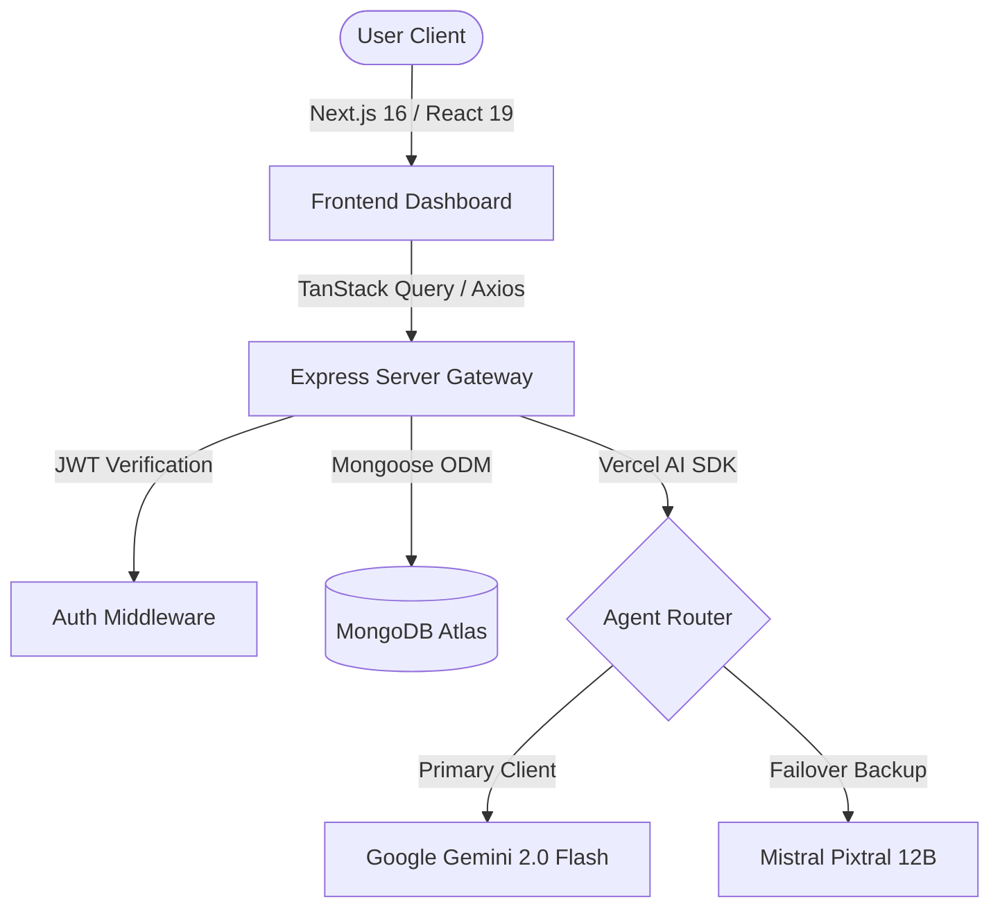

# GreenPulse AI — Full-Stack Agentic ESG Audit & Decarbonization Platform

[](#)
[](#)
[](#)

GreenPulse AI is a production-grade, enterprise-ready Environmental, Social, and Governance (ESG) platform. It provides organizations with automated Scope 1-3 carbon intelligence layers, interactive glassmorphic telemetry dashboards, and autonomous agent-led auditing workflows. The platform is designed to streamline corporate sustainability audits, identify high-risk emissions bottlenecks, and generate actionable decarbonization pathways.

🌐 **Live Dashboard Demo:** [GreenPulse Client Dashboard](https://greenpulse-client.vercel.app) | [GreenPulse Server API](https://greenpulse-server.vercel.app)

---

## 🚀 Key Agentic AI Features

### 1. AI Document Intelligence & Utility OCR (Feature A & F)
* **Path**: `/items/add`
* **Agent Behavior**: Orchestrates a self-healing, multi-model fallback pipeline (built on the Vercel AI SDK). If the primary Google Gemini model (`gemini-2.0-flash`) experiences rate limits (HTTP 429), server fatigue (500), or quota exhaustions, the system catches the error, logs a diagnostic entry, and transparently executes a failover routing request to Mistral AI (`pixtral-12b-2409`). It extracts structured audit values (kWh, tons of CO2e, fiscal dates, facility names) from scanned invoices and pre-fills forms with strict Zod schema validation.

### 2. Context-Aware Decarbonization Copilot (Feature B & C)
* **Path**: `/chat` and `/support`
* **Agent Behavior**: A conversational assistant integrated directly with the user's logged audits. Using system prompts making it a "Senior Sustainability & Decarbonization Consultant for GreenPulse AI", it maintains memory history and utilizes tool-calling parameters (like `getAuditMetrics` or `suggestDecarbonizationStrategy`) to query live MongoDB documents and answer carbon footprint queries.

### 3. Carbon Telemetry Data Analyzer (Feature D)
* **Path**: `/carbon-analysis`
* **Agent Behavior**: Accepts uploads of raw CSV and JSON energy telemetry logs. The AI calculates total emissions, pinpoints peak usage periods, rates energy efficiency (0-100), and auto-detects operational baseline anomalies (mechanical failures, thermal leakage, grid spikes) inside standard checklists, while feeding clean trend streams directly to interactive Recharts line charts.

### 4. AI Auto Classification & Compliance Tagging (Feature E)
* **Path**: Backend database triggers on creation.
* **Agent Behavior**: Analyzes user-entered descriptions and facility records using a structured Gemini schema parser to generate 3-5 tracking hashtags (such as `#Scope2Spike`, `#GridDependence`, or `#FossilOffsets`), appending them dynamically to the saved audit entries.

---

## 🛠️ Technical Architecture



### Frontend Component Structure
* **Core Layout**: Next.js 16 App Router, TypeScript type safety, and Tailwind CSS.
* **State & Fetching**: TanStack Query (React Query) handles mutation and queries, ensuring instantaneous client caching.
* **Visualizations**: Responsive Recharts Line and Pie Charts mapping energy consumption against carbon equivalents.
* **Responsive Guards**:
  - All metrics cards wrap long layout labels (like `"Scope 2 (Indirect Energy)"`) utilizing flex-shrink guards, `min-w-0`, and `break-words`.
  - Audits management tables utilize `w-full overflow-x-auto` wrappers and `max-w-md` cell padding limits.
  - Interactive Audit Cards feature sleek glassmorphic overlays (`backdrop-blur-md bg-zinc-900/30 border border-zinc-800/80 hover:border-emerald-500/40`), group-hover image zoom transitions, and Unsplash mapping based on case-insensitive facility type matching.
  - A premium custom `404 Not Found` page coordinates return-to-dashboard safety paths.

### Backend Layout
* **Framework**: Node.js & Express.js written in TypeScript.
* **ODM / Database**: MongoDB via Mongoose.
* **Security**: HTTP-Only cookies, JWT session protection, CORS controls, and parameter sanitization wrappers.

---

## 💻 Local Installation & Setup

### Prerequisites
* **Node.js** v18 or later.
* **MongoDB** instance (Local or MongoDB Atlas URI).
* **API Keys**: Google Gemini API key and Mistral AI API key.

### 1. Clone & Install Dependencies
```bash
# Clone the repository
git clone https://github.com/saikot05/greenpulse.git
cd greenpulse

# Install Server Dependencies
cd greenpulse-server
npm install

# Install Client Dependencies
cd ../greenpulse-client
npm install
```

### 2. Configure Environment Variables
Create a `.env` file in the root of `greenpulse-server`:
```env
PORT=5000
MONGODB_URI=mongodb+srv://<username>:<password>@cluster0.mongodb.net/greenpulse
JWT_SECRET=your_jwt_secret_token
GEMINI_API_KEY=your_google_gemini_key
MISTRAL_API_KEY=your_mistral_ai_key
```

Create a `.env.local` file in the root of `greenpulse-client`:
```env
NEXT_PUBLIC_API_URL=http://localhost:5000/api/v1
```

### 3. Run Development Servers
Start the backend server:
```bash
cd greenpulse-server
npm run dev
```

Start the frontend client:
```bash
cd greenpulse-client
npm run dev
```

---

## 🔒 Verification & Build Logs
Both backend and client repositories compile perfectly with zero linter errors or type check alerts.

### Backend Build Compilation
```bash
> greenpulse-server@1.0.0 build
> tsc

# COMPILATION PASSED WITH CODE 0
```

### Frontend Build Compilation
```bash
> greenpulse-client@0.1.0 build
> next build

▲ Next.js 16.2.10 (Turbopack)
- Environments: .env.local

  Creating an optimized production build ...
✓ Compiled successfully in 20.4s
  Running TypeScript ...
  Finished TypeScript in 20.8s ...
  Collecting page data using 7 workers ...
  Generating static pages using 7 workers (0/18) ...
  Generating static pages using 7 workers (4/18) 
  Generating static pages using 7 workers (8/18) 
  Generating static pages using 7 workers (13/18) 
✓ Generating static pages using 7 workers (18/18) in 1810ms
  Finalizing page optimization ...

Route (app)
┌ ○ /
├ ○ /_not-found
├ ○ /about
├ ƒ /api/auth/[...all]
├ ○ /carbon-analysis
├ ○ /chat
├ ○ /contact
├ ○ /explore
├ ƒ /explore/[id]
├ ○ /items/add
├ ○ /items/manage
├ ○ /login
├ ○ /privacy
├ ○ /profile
├ ○ /register
├ ○ /settings
├ ○ /support
└ ○ /terms

# BUILD COMPLETED SUCCESSFULLY
```

---

## 📄 License
Distributed under the MIT License. See `LICENSE` for more details.
