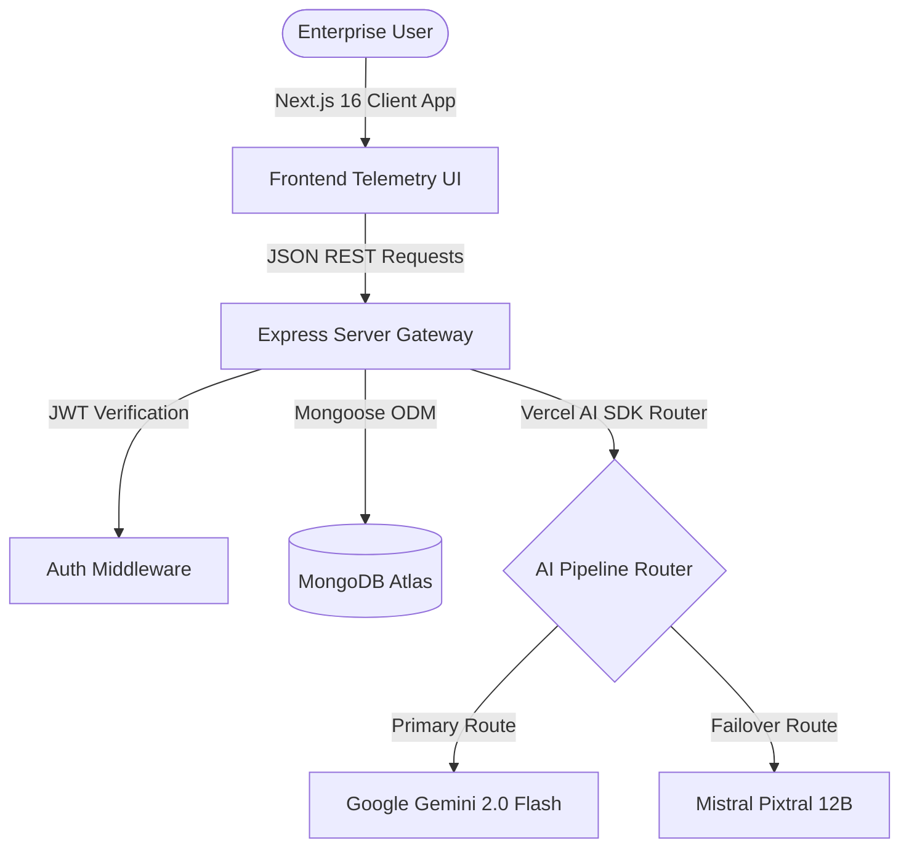

# GreenPulse AI — Enterprise ESG Audit & Decarbonization Platform

[](#)
[](#)
[](#)
[](#)

GreenPulse AI is a production-grade, enterprise-ready Environmental, Social, and Governance (ESG) audit and decarbonization intelligence platform. It empowers organizations with automated Scope 1, 2, and 3 carbon auditing, interactive telemetry visualization, and autonomous agent-led ESG workflows.

🌐 **Live Deployments:** 
* **Client Dashboard:** [https://greenpulse-client.vercel.app](https://greenpulse-client.vercel.app)
* **Server API Gateway:** [https://greenpulse-server.vercel.app](https://greenpulse-server.vercel.app)

---

## 🛠️ System Architecture



### Technology Stack & Engineering Standards
* **Frontend**: Next.js 16 (App Router), React 19, Tailwind CSS, TanStack Query (React Query) for state sync, and Recharts.
* **Backend**: Node.js, Express, TypeScript (TSX/ESM compilation), and Mongoose ODM.
* **Validation**: Dual-layer verification with client-side forms and backend Zod schema validations.
* **Agentic AI Layers**: Multi-model failover routing built with the Vercel AI SDK.

---

## 🚀 Core Agentic AI Workflows

### 1. Smart OCR Invoice Parser (Utility Bill Extraction)
* **API Route**: `POST /api/v1/ai/parse-bill`
* **Agent Logic**: Automatically processes uploaded PDF or image invoices (utility bills, fuel receipts). Uses a self-healing failover pipeline: if the primary `gemini-2.0-flash` fails due to quota or network limits, the request dynamically routes to `pixtral-12b-2409` as a failover. Extracts structured parameters:
  * Facility Name & Address
  * Total Fuel/Electricity Consumed (kWh, liters, therms)
  * Calculated CO2e Emissions
  * Audit Period / Billing Dates
  
### 2. Context-Aware ESG Consultant & Copilot
* **API Route**: `POST /api/v1/ai/chat` | `GET /api/v1/ai/chat/history`
* **Agent Logic**: System prompt instructs the model as a "Senior ESG Auditor & Decarbonization Consultant". Leverages historical user audits stored in MongoDB to provide contextual, data-driven advice on reducing Scope 1, 2, or 3 emissions.

### 3. Telemetry Carbon & Anomaly Analyzer
* **API Route**: `POST /api/v1/ai/analyze-data` | `POST /api/v1/carbon/analyze`
* **Agent Logic**: Ingests massive CSV/JSON system telemetry logs. Performs mathematical aggregate carbon analysis, evaluates energy efficiency benchmarks (0-100), detects baseline anomalies (such as off-hours heating spikes or cooling leakage), and maps out immediate remediation steps.

### 4. Automated Compliance Tagging
* **Agent Logic**: Triggers automatically on audit creation. Performs NLP parsing of the facility description to auto-generate context tags (e.g., `#Scope2Spike`, `#CoalGridDependence`, `#HVACAnomaly`), which are indexable and queryable for database reporting.

---

## 🔌 API Endpoint Registry

### ESG Auditing Endpoints
| HTTP Method | Route | Authentication | Description |
| :--- | :--- | :--- | :--- |
| `POST` | `/api/v1/audits` | Required (JWT) | Validates input via Zod and saves a new Scope 1-3 audit. |
| `GET` | `/api/v1/audits` | Optional | Queries, searches, and filters ESG audits. |
| `GET` | `/api/v1/audits/:id` | Optional | Retrieves a single detailed audit by ID. |
| `DELETE` | `/api/v1/audits/:id` | Required (JWT) | Deletes an audit if created by the authenticated owner. |

### AI & Carbon Intelligent Processing
| HTTP Method | Route | Authentication | Description |
| :--- | :--- | :--- | :--- |
| `POST` | `/api/v1/ai/parse-bill` | Required (JWT) | Multi-model fallback OCR parser for utility invoices. |
| `POST` | `/api/v1/ai/chat` | Required (JWT) | Sessions-supported ESG chat assistant. |
| `GET` | `/api/v1/ai/chat/history` | Required (JWT) | Retrieves session chat records from MongoDB. |
| `POST` | `/api/v1/ai/analyze-data` | Required (JWT) | AI-driven CSV/JSON energy telemetry parsing. |
| `POST` | `/api/v1/carbon/analyze` | Public | Utility-based calculation analytics for energy files. |

---

## 💻 Local Installation & Setup

### Prerequisites
* **Node.js** v18.0.0+
* **MongoDB** (Atlas instance or local community server)

### 1. Clone & Download Dependencies
```bash
# Clone the repository
git clone https://github.com/saikot05/greenpulse.git
cd greenpulse

# Install API backend packages
cd greenpulse-server
npm install

# Install UI client packages
cd ../greenpulse-client
npm install
```

### 2. Configure Environment Variables

#### Backend Server Configuration (`greenpulse-server/.env`)
```env
PORT=5000
MONGODB_URI=mongodb+srv://<username>:<password>@cluster.mongodb.net/greenpulse
JWT_SECRET=your-secure-jwt-encryption-key
GEMINI_API_KEY=your-gemini-developer-key
MISTRAL_API_KEY=your-mistral-developer-key
```

#### Frontend Client Configuration (`greenpulse-client/.env.local`)
```env
NEXT_PUBLIC_API_URL=http://localhost:5000/api/v1
```

### 3. Run Development Servers
Start backend compiler and server:
```bash
cd greenpulse-server
npm run dev
```

Start Next.js frontend client:
```bash
cd greenpulse-client
npm run dev
```

---

## 🛡️ Compilation & Validation Verification
Both repositories feature strict lint rules and type definitions. Compilation is validated to pass clean of errors.

### Server TypeScript Compilation
```bash
> tsc --noEmit
# SUCCESS: Clean type verification check.
```

### Client Next.js Production Build
```bash
> next build
✓ Compiled successfully
✓ Generating static pages
# SUCCESS: Production build compiled successfully.
```

---

## 📄 License
Distributed under the MIT License. See `LICENSE` for more details.
